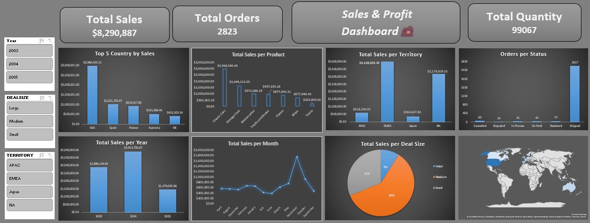

# Sales & Profit Dashboard

## Project Overview
This project is a **Sales & Profit Dashboard** built in Excel, designed to provide insights into sales performance, revenue, and profitability. The dashboard allows users to track key business metrics and make data-driven decisions efficiently.

## Key Features
- **Data Cleaning & Transformation:** Using Power Query
- **Calculated Columns:**
  - Revenue = Price × Quantity
  - Delivery Days = Delivery_Date - Order_Date
- **Time-based Analysis:** Monthly and hourly trends
- **Data Modeling:** Relationships between tables for accurate analysis
- **Interactive Visual Analysis:** Pivot Tables, Charts, and Slicers
- **Key Performance Indicators (KPIs):**
  - Total Revenue
  - Average Delivery Time
  - Top Products by Sales
  - Profit Analysis

## Dashboard Preview

## How to Use
1. Open the Excel file `Sales_Profit_Dashboard.xlsx`.
2. Refresh the data using Power Query to load the latest information.
3. Explore interactive Pivot Tables and Charts to analyze sales performance.
4. Use slicers to filter by time periods, product categories, or regions.

## Benefits
- Identify top-performing products and regions
- Monitor sales trends and profitability
- Support informed business decisions with interactive visuals

## License
This project is open for personal and educational use.
